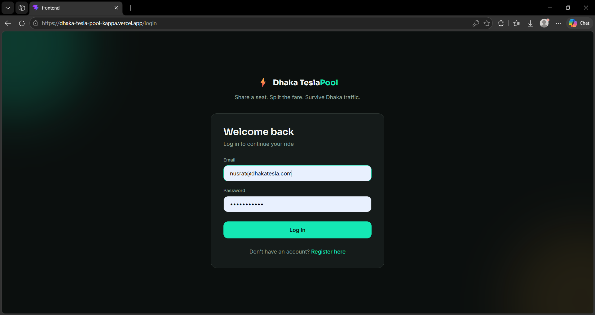
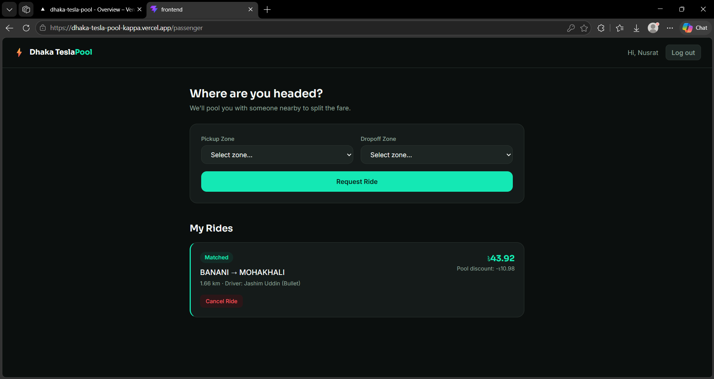
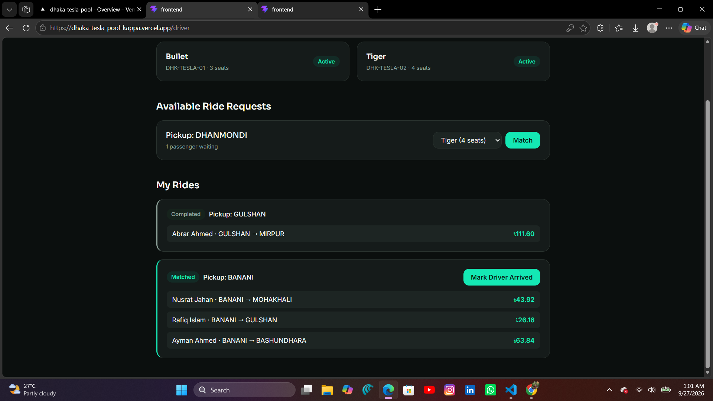

# Dhaka Tesla Pool 🚗⚡

> Share a seat. Split the fare. Survive Dhaka traffic.

## Summary

Dhaka Tesla Pool is a ride-pooling MVP built for the RoBenDevs internship challenge. Passengers request a ride by naming a pickup and dropoff zone; if another passenger heading out from the same pickup zone is already waiting, they're automatically pooled into the same Tesla and split the fare. Drivers register their vehicle, accept open pooled requests, and run the trip through a full lifecycle from match to completion.

## Problem Statement

Ride-hailing in Dhaka is expensive and traffic-heavy when every passenger rides alone. This project explores a narrow, concrete version of the pooling problem: given a fixed driver (Jashim) and vehicle (Bullet, a 3-seat Tesla), and a handful of passengers (Nusrat, Rafiq, Shirin) all requesting rides around the same time, how do you match, price, and sequence multiple riders sharing one car — correctly, and without letting two people accidentally claim the same seat at the same time?

## Features Implemented

- **Authentication** — JWT-based register/login for both passengers and drivers
- **Ride requests** — a passenger picks a pickup/dropoff zone from a fixed set of Dhaka areas
- **Automatic pooling** — requests sharing a pickup zone are matched into the same ride/Tesla, up to its seat capacity
- **Atomic seat claiming** — two passengers racing for the last seat can never both succeed (see Concurrency section)
- **Fare calculation** — deterministic base + distance + pool discount formula, computed in integer poysha
- **Full ride lifecycle** — REQUESTED to MATCHED to DRIVER_ARRIVED to STARTED to COMPLETED, with CANCELLED reachable from any active state
- **Per-passenger privacy** — each passenger sees only their own fare and status, never another rider's
- **Driver dashboard** — register vehicles, view open ride requests, match, and advance ride status
- **Audit trail** — every status transition is logged with who triggered it and when
- **Seed script** — reproducible demo data using the story cast (Jashim/Bullet, Nusrat, Rafiq, Shirin)
- **Automated tests** — 29 tests covering fare math, concurrency, state transitions, and auth

## Live Demo

- Frontend: https://dhaka-tesla-pool-kappa.vercel.app
- Backend API: https://dhaka-tesla-pool-ncam.onrender.com

## Screenshots

**Login**


**Passenger Dashboard — pooled ride with individual fare**


**Driver Dashboard — a 3-passenger pool sharing one Tesla, each with their own fare**


## Tech Stack

| Layer            | Choice                                   |
| ---------------- | ---------------------------------------- |
| Frontend         | React (Vite) + Tailwind CSS              |
| Backend          | Node.js + Express                        |
| Database         | MongoDB (Atlas) + Mongoose               |
| Auth             | JWT + bcrypt                             |
| Testing          | Jest + Supertest + mongodb-memory-server |
| Containerization | Docker (backend)                         |

## Architecture

See `docs/architecture-diagram.png` and `docs/erd-diagram.png` — both drawn before implementation began, per the project's "architecture first" requirement. Full written schema and rationale: `docs/SCHEMA.md`.

Browser → React Frontend → Node.js + Express API → MongoDB

No microservices, Kafka, Kubernetes, Redis, or queues — a single Node.js
API and MongoDB are sufficient for this MVP's actual scale.

## Project Structure

dhaka-tesla-pool/
├── backend/
│ ├── src/
│ │ ├── models/ # Mongoose schemas
│ │ ├── services/ # Business logic (fare calc, pooling, state machine, auth)
│ │ ├── controllers/ # HTTP request handlers
│ │ ├── routes/ # Express route definitions
│ │ ├── middleware/ # Auth, error handling
│ │ └── utils/ # Constants, error classes, seed script
│ ├── tests/ # Jest test suites
│ └── Dockerfile
├── frontend/
│ └── src/
│ ├── pages/ # Login, Register, Passenger/Driver dashboards
│ ├── context/ # AuthContext
│ ├── api/ # API client + endpoint functions
│ └── theme.js # Design tokens
├── docs/ # Schema doc, architecture diagram, ERD
└── docker-compose.yml

## Prerequisites

- Node.js 18+
- npm
- A MongoDB Atlas account (free tier) — or a local/Dockerized MongoDB instance
- Docker Desktop (optional, only needed for the containerized backend)

## Environment Variables

Never commit real secrets. Copy `.env.example` and fill in your own values.

**`backend/.env`**

MONGO_URI=mongodb+srv://<user>:<password>@<cluster>.mongodb.net/dhaka_tesla_pool?retryWrites=true&w=majority
JWT_SECRET=<a long random string>
JWT_EXPIRES_IN=7d
PORT=5000
NODE_ENV=development
CORS_ORIGIN=http://localhost:5173

**`frontend/.env`**

VITE_API_URL=http://localhost:5000/api

**Root `.env`** (only needed if running the backend via Docker Compose) —
same variables as `backend/.env`.

## Local Setup

### 1. Clone the repository

```bash
git clone https://github.com/Abrar-here/dhaka-tesla-pool.git
cd dhaka-tesla-pool
```

### 2. Backend

```bash
cd backend
npm install
# create backend/.env as shown above
npm run dev
```

### 3. Seed demo data (recommended)

```bash
npm run seed
```

### 4. Frontend

In a separate terminal:

```bash
cd frontend
npm install
# create frontend/.env as shown above
npm run dev
```

Visit `http://localhost:5173`.

## Docker

The backend can run in a container while still connecting to your MongoDB
Atlas database (Atlas is cloud-hosted, so it isn't containerized locally).

From the project root, with a root-level `.env` present:

```bash
docker compose up --build
```

The API will be available at `http://localhost:5000`.

## Running Tests

```bash
cd backend
npm test
```

29 tests across 4 suites:

- `fareService.test.js` — fare calculation correctness, integer-only money math
- `poolService.concurrency.test.js` — proves two passengers racing for the last seat can never both succeed, and seat counts never exceed capacity or go negative
- `rideStateService.test.js` — valid/invalid state transitions, ownership checks (a driver can't advance someone else's ride, a passenger can't cancel someone else's request), and pool isolation (cancelling one passenger doesn't affect another in the same pool)
- `authService.test.js` — registration validation, duplicate email rejection, login failure handling, JWT correctness, no user enumeration via error messages

## Demo Credentials

After running `npm run seed` (password for all: `password123`):

| Role      | Email                 | Notes                                                          |
| --------- | --------------------- | -------------------------------------------------------------- |
| Driver    | jashim@dhakatesla.com | Owns "Bullet" (3-seat Tesla), already matched to a pooled ride |
| Passenger | nusrat@dhakatesla.com | Pooled with Rafiq on the same ride from Banani                 |
| Passenger | rafiq@dhakatesla.com  | Pooled with Nusrat on the same ride from Banani                |
| Passenger | shirin@dhakatesla.com | Free to demo a fresh ride request or a last-seat race          |

## Deployment

- **Frontend (Vercel):** https://dhaka-tesla-pool-kappa.vercel.app
- **Backend API (Render):** https://dhaka-tesla-pool-ncam.onrender.com

Both are on free tiers, per the project's cost constraints. Note: Render's
free tier spins the service down after a period of inactivity, so the
first request after idle time may take 30-60 seconds to respond while it
wakes back up.

## API Overview

Base URL: `http://localhost:5000/api`

| Method | Endpoint                          | Auth                 | Description                                |
| ------ | --------------------------------- | -------------------- | ------------------------------------------ |
| POST   | `/auth/register`                  | —                    | Register a passenger or driver             |
| POST   | `/auth/login`                     | —                    | Log in, receive a JWT                      |
| GET    | `/auth/me`                        | ✓                    | Get the current user                       |
| POST   | `/teslas`                         | ✓ (driver)           | Register a vehicle                         |
| GET    | `/teslas/mine`                    | ✓ (driver)           | List my vehicles                           |
| PATCH  | `/teslas/:id/active`              | ✓ (driver)           | Toggle a vehicle active/inactive           |
| GET    | `/rides/zones`                    | ✓                    | List valid pickup/dropoff zones            |
| POST   | `/rides`                          | ✓ (passenger)        | Request a ride (auto-pools if possible)    |
| GET    | `/rides/mine`                     | ✓ (passenger)        | List my ride memberships                   |
| POST   | `/rides/members/:memberId/cancel` | ✓ (passenger)        | Cancel my own ride request                 |
| GET    | `/rides/available`                | ✓ (driver)           | List open ride requests to match           |
| GET    | `/rides/driver/mine`              | ✓ (driver)           | List rides I've matched, with pool members |
| POST   | `/rides/:id/match`                | ✓ (driver)           | Match my Tesla to a ride                   |
| POST   | `/rides/:id/advance`              | ✓ (driver)           | Advance a ride's status                    |
| GET    | `/rides/:id/history`              | ✓ (driver or member) | View a ride's full audit trail             |

## Key Decisions & Trade-offs

- **Matching rule:** two ride requests are poolable if they share the same
  pickup zone and a seat is free on an existing request. Deliberately
  simple and explainable rather than modeling real route-overlap/detour
  cost, which would need a routing engine out of scope for this MVP.
- **Concurrency ("last seat" problem):** seat claims use MongoDB's atomic
  `findOneAndUpdate` with a conditional filter (`seatsTaken < seatsTotal`),
  not a read-then-write pattern — so two passengers racing for the last
  seat can never both succeed. See `backend/tests/poolService.concurrency.test.js`
  for the proof, and `docs/SCHEMA.md` for the full rationale.
- **Money handling:** all fares are stored as integers in poysha (1 Taka =
  100 poysha), the same principle as storing USD in cents, to avoid
  floating-point rounding errors in financial math.
- **Fare formula:** `passengerFare = baseFare + (distanceKm × perKmRate) − poolDiscount`,
  fully deterministic and hand-verifiable — see `docs/SCHEMA.md` for a
  worked example using Nusrat and Rafiq's actual pooled ride.
- **Distance calculation:** straight-line (haversine) distance between
  fixed zone centroids, not a real routing API — kept the MVP self-contained
  and reproducible without external API keys or costs.
- **Single Tesla-trip model:** a `Ride` represents one vehicle's trip and
  can hold 1..N passengers (via `RideMember`), rather than one ride
  document per passenger — this made atomic capacity enforcement and
  per-passenger privacy both possible from the same schema.
- **No over-engineering:** no microservices, Kafka, Kubernetes, Redis, or
  queues — a single Node.js API and MongoDB are sufficient for this MVP's
  scale.

## Known Limitations

- Matching only considers pickup zone, not dropoff proximity or route
  overlap — a passenger could be pooled with someone going a very
  different direction from the same starting zone.
- No real-time updates (WebSockets) — the frontend requires a manual
  refresh to see status changes made by another party (e.g. a passenger
  won't see "Driver Arrived" until they reload).
- No payment processing — `paymentMethod`/`paymentStatus` exist on the
  data model but there's no real payment gateway integration.
- Geography is a fixed list of 8 Dhaka zones with hardcoded coordinates,
  not real map data or address-level pickup.
- No rate limiting or abuse protection on the API yet.
- Frontend has no automated test suite (backend has 29 tests; frontend
  testing was deprioritized given the project timeline).

## Next Improvements

- Real-time ride status via WebSockets or polling, so both parties see
  updates without refreshing.
- Smarter matching that considers dropoff direction/route overlap, not
  just shared pickup zone.
- A ratings/review system between passengers and drivers.
- Real payment gateway integration (e.g. bKash/Nagad sandbox for a
  Bangladesh-specific MVP).
- Rate limiting and request throttling on write-heavy endpoints
  (ride requests, matching).
- Frontend automated tests (component and integration level).

## Scaling Discussion (1M Passengers / 100k Drivers)

At MVP scale, a single Node.js API instance and one MongoDB database are
genuinely sufficient — adding infrastructure now would be complexity
without a corresponding problem to solve. Scaling to roughly 1M passengers
and 100k drivers would require rethinking several parts of this design
specifically:

- **Horizontal scaling & load balancing:** run multiple stateless API
  instances behind a load balancer; since auth is JWT-based (not
  session-based), any instance can handle any request without sticky
  sessions.
- **Database indexing & read replicas:** the existing indexes
  (`rides.status`, `rides.driver`, `ridemembers.passenger`, etc.) would
  need to be joined by read replicas to offload the heavy "available
  rides" and "my rides" queries from the primary write node.
- **Geospatial search:** the current fixed-zone matching (`pickupZone`
  equality) would need to become a real geospatial query — MongoDB's
  `2dsphere` indexes and `$geoNear` would replace the zone-name lookup,
  matching passengers by actual proximity rather than a named area.
- **DB contention on seat claiming:** the current atomic
  `findOneAndUpdate` approach works well at MVP scale but could become a
  hot-document bottleneck under very high concurrent demand for the same
  popular pickup zone. At scale, this would likely move to a dedicated
  matching/reservation service using short-lived optimistic locks or a
  per-zone queue to serialize contention, with idempotency keys so
  retried client requests can't double-claim a seat.
- **Caching:** frequently-read, slow-changing data (zone lists, a
  driver's own vehicle list) would move to a cache (e.g. Redis) in front
  of MongoDB, while ride status itself would stay uncached since it
  changes too often to be worth it.
- **Real-time communication:** WebSockets (or a managed pub/sub service)
  would replace manual refreshing, so drivers and passengers see status
  changes instantly.
- **Queues/events:** ride-matching, fare recalculation, and notification
  dispatch would move off the synchronous request path and onto an
  event queue, so a spike in ride requests doesn't block the API thread
  handling them.
- **Rate limiting & idempotency:** every write endpoint (especially ride
  requests and matching) would need rate limiting per user and
  idempotency keys to safely handle client retries without creating
  duplicate rides.
- **Observability:** structured logging, request tracing, and metrics
  (matching success rate, average match latency, seat-claim conflict
  rate) would be essential to detect and diagnose problems at that scale.
- **Security:** stricter input validation, audit logging (already
  present at MVP scale via `RideStatusHistory`), and likely a move from
  a single shared JWT secret to short-lived access tokens with refresh
  tokens.
- **Deployment strategy:** blue-green or canary deployments to avoid
  downtime during releases, with database migrations handled
  separately from application deploys.

Reasoning about _why_ each of these becomes necessary at scale matters
more than listing every possible technology — most of this MVP's current
architecture is intentionally the simplest thing that could work, precisely
so that each of the above additions has a clear, specific problem it
solves rather than being added preemptively.

## AI Usage

AI tools (Claude) were used throughout this project's development as a
pair-programming and planning aid — not to generate an opaque final
product. Specifically:

- **What for:** scaffolding the initial project structure and file
  layout; drafting Mongoose schemas and Express routes/controllers from
  an agreed design; explaining and helping author the atomic
  `findOneAndUpdate` concurrency pattern for seat claiming; drafting Jest
  test suites for fare calculation, concurrency, state transitions, and
  auth; drafting UI components in React/Tailwind against an agreed design
  system; drafting this README.
- **One accepted suggestion:** using MongoDB's atomic `findOneAndUpdate`
  with a conditional filter (`seatsTaken < seatsTotal`) for seat claiming,
  instead of reading the ride document, checking capacity in application
  code, and then saving. This was accepted because it moves the
  correctness guarantee into the database's own atomicity rather than
  relying on application-level timing, which is a strictly stronger
  guarantee against race conditions.
- **One rejected/changed suggestion:** an early version of the fare
  service considered storing fares as JavaScript floating-point numbers
  (Taka with decimals). This was rejected in favor of storing everything
  as integer poysha (1 Taka = 100 poysha), because floating-point
  arithmetic in JavaScript introduces rounding errors in financial
  calculations (e.g. `0.1 + 0.2 !== 0.3`) — the same reasoning that leads
  most payment systems to store money in the smallest integer currency
  unit (e.g. cents) rather than decimal dollars.

Every part of this codebase — the schema design, the concurrency handling,
the state machine, the fare math, and the UI — was reviewed, tested, and
is understood well enough to explain, defend, or modify live.

## Demo Video

_(Here is the Link to an 11-minute Loom/screen recording is added here, covering: the
problem and core idea in my own words, how it was engineered — architecture,
backend, frontend, database design, the ride/pool lifecycle, one key
decision, one trade-off — and a product tour of the passenger flow, driver
flow, pooling, fare/status, one edge case, and deployment.)_

**https://drive.google.com/file/d/1W51gap-8LxtDGjxpMvsWJMybZq7BZYer/view?usp=sharing**

## Author

Built by Abrar Ahmed as part of the RoBenDevs internship application.
